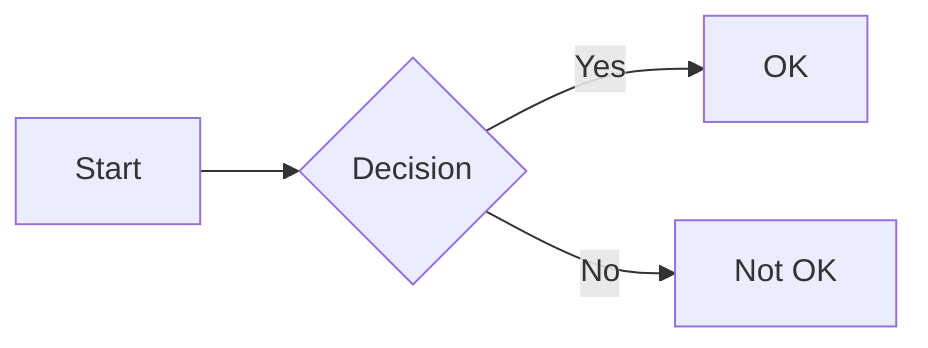

# Test Document

This is a test of **mdiew**, a minimal macOS Markdown viewer.

## Features

- [x] GFM Task lists
- [ ] More features coming
- Regular bullet points

## Code Block

```rust
fn main() {
    println!("Hello, world!");
}
```

## Table

| Feature | Status |
|---------|--------|
| Tables | Working |
| Code blocks | Working |
| Task lists | Working |
| Mermaid | Coming soon |

## Blockquote

> This is a blockquote.
> It can span multiple lines.

## Links

Visit https://example.com for more info.

---

## Footnotes

Here is a footnote reference[^1].

[^1]: This is the footnote content.

## Strikethrough

This is ~~deleted~~ text.

## Mermaid (placeholder)


